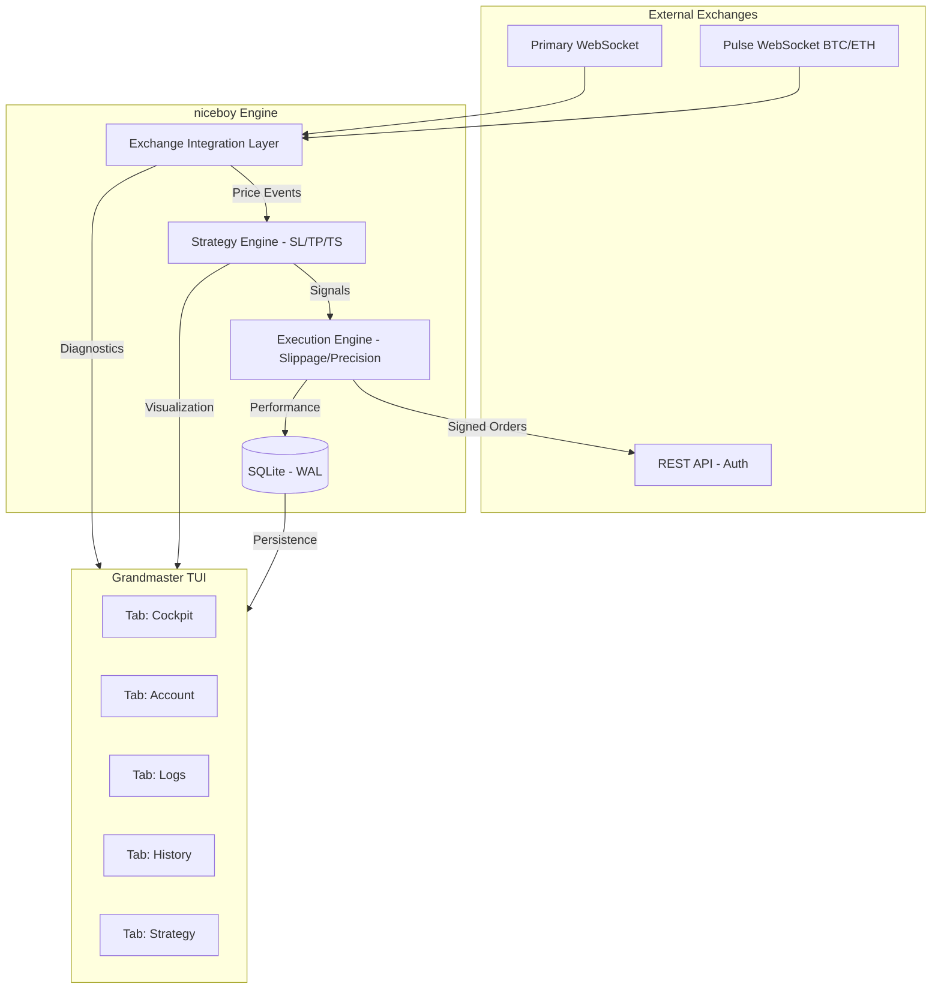

# 🏗️ niceboy Architecture (v1.5)

`niceboy` is designed with a modular, event-driven architecture to ensure high performance and low latency while maintaining a small resource footprint.

## 🏛️ Design Philosophy: The Five Pillars

### 1. 👫 User Friendly (Accessibility)
- **Grandmaster TUI**: Powered by **Bubble Tea** and **Lipgloss**, providing a professional 5-tab "Flight Deck":
    - **[0] Cockpit**: Mission control with real-time ASCII chart, Execution Markers, and **Order Book Heatmap**.
    - **[1] Account**: Real-time balances (USDT/USDC prioritized) and Open Orders.
    - **[2] Audit Logs**: Scrolling system events and diagnostic feed.
    - **[3] History**: Persistent trade history queried from SQLite.
    - **[4] Strategy**: Parameters, trend filters, and mechanical guardrails.
- **Tactical Hotkeys**: Standardized keys for manual intervention (`[b]`, `[s]`) and **Emergency Kill Switch** (`[k]`).

### 2. ⚡ Speed (Latency)
- **Go 1.24+ Runtime**: Leveraged for ultra-efficient GC and concurrency.
- **WebSocket Streaming**: Native TCP/TLS streams for sub-millisecond price updates.
- **Connectivity Monitoring**: Real-time **API Latency (ms)** tracking integrated into the Cockpit.

### 3. 🚀 Performance (Resource Efficiency)
- **Sub-10MB Memory**: Optimized for high-density execution on VPS or edge devices.
- **WAL-Mode Persistence**: SQLite with Write-Ahead Logging for zero-wait database operations.

### 4. 🛡️ Security (Zero-Trust)
- **Secret Scanning**: Mandatory pre-commit hooks ensure zero API keys are ever committed6.  **Interactive TUI (Bubble Tea)**: The TUI acts as the Command & Control center, providing both observation (Cockpit) and tactical intervention. Key commands (`b`/`s`/`k`) are dispatched via a thread-safe channel to the Trade Engine.

### 🛡️ Safety & Guardrails
- **Pre-execution Balance Check**: The engine validates sufficient funds before any order execution (Buy or Sell).
- **Persistent Global Halt**: Emergency Kill Switch state is stored in SQLite to survive restarts.
- **Slippage Protection**: Automated SMA signals are executed as "Protected Limit Orders" with a configurable slippage buffer.
- **Elite Logic**: Integrated **Trailing Stops**, **EMA Trend Filters**, and **SL/TP** guardrails.

## 📡 Data Flow

## 🔋 Technology Stack

- **Core**: Go 1.24+ (Statically linked).
- **Interface**: Bubble Tea & Lipgloss.
- **Storage**: SQLite 3 (WAL mode).
- **Logging**: Zerolog (JSON + Human-friendly).
- **Distribution**: GoReleaser (Multi-arch), Docker (Alpine-based).
