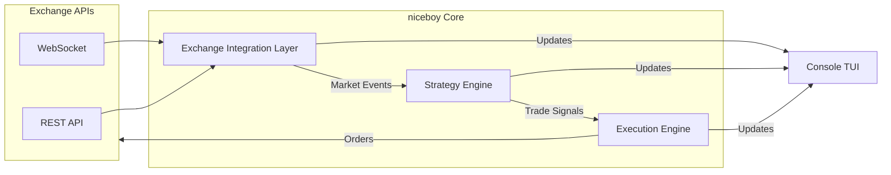

# 🏗️ niceboy Architecture

`niceboy` is designed with a modular, event-driven architecture to ensure high performance and low latency while maintaining a small resource footprint.

## 🏛️ Design Philosophy: The Five Pillars

`niceboy` is architected to balance institutional-grade performance with individual ease-of-use.

### 1. 👫 User Friendly (Accessibility)
- **Interactive TUI**: Powered by **Bubble Tea** and **Lipgloss**, providing a rich, responsive terminal dashboard. It features structured, bordered box layouts that clearly separate the Header (Exchange/Symbol), Live Stats (Price/Trades), Strategy Signals, and an interactive Audit Log viewport.
- **Intuitive Config**: Unified YAML structure with strict validation, making it easy to swap exchanges or strategies in seconds.
- **Clear Feedback**: Human-readable console logs synchronized with high-precision audit trails.

### 2. ⚡ Speed (Latency)
- **Go 1.24+ Runtime**: Leverages the latest runtime improvements for garbage collection and scheduler efficiency.
- **WebSocket Streaming**: (Implementation in progress) Direct TCP/TLS streams for sub-millisecond market updates.
- **Efficient Signaling**: Strategy logic executes in the "hot path," ensuring zero unnecessary allocations between data receipt and signal generation.

### 3. 🚀 Performance (Resource Efficiency)
- **Sub-10MB Memory**: Optimized for low-power VPS instances or side-car execution.
- **Statically Linked**: No external library dependencies; a single binary that "just works" across all OS targets.
- **Concurrent Scaling**: Modular architecture allows running multiple instances without performance degradation.

### 4. 🛡️ Security (Zero-Trust)
- **Local-First**: API keys never leave your machine; no cloud middle-man.
- **Environment Inversion**: Support for `NICEBOY_*` environment variables keeps secrets out of static files.
- **Audit Traceability**: Structured JSON logging (`niceboy.log`) for full forensic audit of every bot action.

### 5. 💰 Trading Profit (Execution)
- **Adapter Pattern**: Unified interface for Binance/Bitkub ensures consistent strategy performance across markets.
- **Resilient Execution**: Panic recovery and context timeouts ensure the bot stays alive and responsive during high-volatility events.
- **Execution Precision**: Decoupled strategy and execution engines allow for sub-second order management.

## 📡 Data Flow

## 🔋 Technology Stack

`niceboy` is built with a focus on efficiency and portability:
- **Language**: [Go 1.24+](https://go.dev/) (Statically-linked, low-latency binary).
- **Logging**: **zerolog** for high-performance, structured JSON output (Console + File).
- **Resilience**: Context timeouts and panic recovery in all critical paths.
- **Configuration Engine**: YAML v3 with strict schema validation and symbology abstraction.

## 🛡️ Security Model

- **Local-First**: All API keys and secrets are stored locally in `config.yaml`.
- **Protection**: `.gitignore` is pre-configured to exclude `config.yaml` and other sensitive files from version control.
- **Encrypted Storage (Planned)**: Future support for platform-specific hardware keychains (macOS Keychain, Linux Secret Service).
