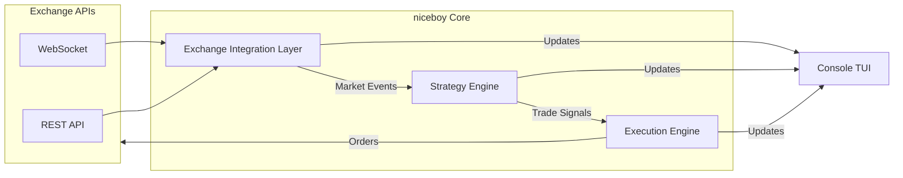

# 🏗️ niceboy Architecture

`niceboy` is designed with a modular, event-driven architecture to ensure high performance and low latency while maintaining a small resource footprint.

## 🧱 Core Components

### 1. **Core Kernel (`niceboy/cmd`)**
- Orchestrates the lifecycle of all other modules.
- Handles configuration loading and CLI command routing.
- Basic error handling and logging foundation.

### 2. **Exchange Integration Layer (`niceboy/internal/exchange`)**
- Provides a unified interface for multiple exchanges (e.g., Binance, Bybit).
- Abstracts WebSocket and REST API differences.
- Manages order books and account balance synchronization.

### 3. **Strategy Engine (`niceboy/internal/strategy`)**
- **Plug-and-Play Pattern**: Uses a `Registry` to dynamically load strategies by name.
- **Unified Interface**: All algorithms implement the `Strategy` interface, receiving `MarketData` and emitting `Signal`.
- **Reference Implementation**: `SMACrossover` serves as a template for custom strategy development.

### 4. **Execution Engine (`niceboy/internal/execution`)**
- Responsible for placing, modifying, and canceling orders.
- **Resilience Layer**: Implements per-iteration panic recovery and context-aware timeouts.
- **Audit Trail**: Every execution event is captured in the structured audit log for post-trade analysis.

### 5. **Console TUI (`niceboy/internal/ui`)**
- Built with **Bubble Tea** for a stateful, component-based TUI.
- **Real-time Visualization**: Synchronized with the structured logging engine for congruent feedback.

## 📡 Data Flow

## 🔋 Technology Stack

`niceboy` is built with a focus on efficiency and portability:
- **Language**: [Go 1.24+](https://go.dev/) (Statically-linked, low-latency binary).
- **Logging**: **zerolog** for high-performance, structured JSON output (Console + File).
- **Resilience**: Context timeouts and panic recovery in all critical paths.
- **Configuration Engine**: YAML v3 with strict schema validation and symbology abstraction.

## 🛡️ Security Model

- **Local-First**: All API keys and secrets are stored locally in `config.yaml`.
- **Protection**: `.gitignore` is pre-configured to exclude `config.yaml` and other sensitive files from version control.
- **Encrypted Storage (Planned)**: Future support for platform-specific hardware keychains (macOS Keychain, Linux Secret Service).
