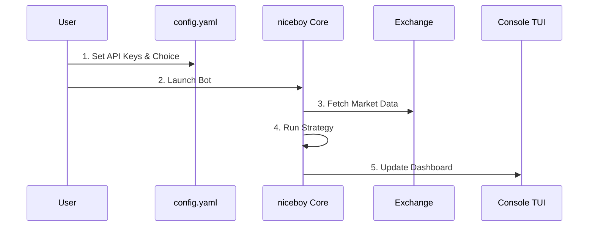

# ⚡ niceboy

> A low-footprint, high-efficiency console trading bot designed for performance and simplicity.

`niceboy` is built for traders who value speed, reliability, and minimal resource usage. It provides a robust foundation for executing automated trading strategies directly from your terminal.

## 🔄 How it Works



## ✨ Features

- **🛡️ Grandmaster Trading Cockpit**: A professional-grade terminal interface featuring a **Real-Time Visual Chart**, **Tactical Hotkeys**, and a high-stakes **EMERGENCY KILL SWITCH** (`k`).
- **📊 ASCII Order Book Heatmap**: Visualize market pressure and liquidity walls with a live top-5 market depth widget.
- **💓 Global Market Pulse**: Side-by-side tracking for **BTC & ETH** to provide essential market context while trading.
- **🚀 Low Footprint**: Optimized Go core with sub-10MB memory usage and extreme CPU efficiency.
- **🖥️ Tabbed TUI Dashboard**: Professionally styled multiple views for **Stats**, **Portfolio**, **Orders**, **Strategy**, and **Audit Logs**.
- **🧪 Dry Run Simulator**: Safely test strategies with real-time market data and simulated execution.
- 🛡️ **Managed Risk**: Built-in **Stop Loss**, **Take Profit**, and **Trailing Stop** guardrails.
- 🔄 **Self-Healing**: Automatic WebSocket reconnection with exponential backoff and connection quality diagnostics.
- 🏗️ **Git Security Hooks**: Pre-commit scanning for leaked secrets and QA enforcement, ensuring 100% test passing.
- **🔌 Multi-Exchange**: Production-ready adapters for **Binance** and **Bitkub** (V3 API).

## 🛠️ Technology Stack

- **Language**: [Go 1.24+](https://go.dev/) (Statically-linked, high-performance binary).
- **Interface**: [Bubble Tea](https://github.com/charmbracelet/bubbletea) & [Lipgloss](https://github.com/charmbracelet/lipgloss) (Tactical Tabbed TUI).
- **Persistence**: [SQLite 3](https://sqlite.org/) (High-concurrency WAL-mode for trade history).
- **Logging**: [zerolog](https://github.com/rs/zerolog) (Structured JSON + Human-readable audit trails).
- **Distribution**: [GoReleaser](https://goreleaser.com/) (Automated Multi-Arch & Docker builds).

## 🧭 Choose Your Journey

Whether you are looking to run the bot or build upon it, follow the path that fits your role:

### 👤 The User Journey (Run the Bot)

_Goal: Deploy `niceboy` and start trading in under 5 minutes._

1. **Quick Start**: [Install & Run](./docs/RUN.md)
2. **Configuration**: [Setting up Keys & Symbols](./docs/RUN.md#configuration)
3. **Management**: [Running Multiple Instances](./docs/RUN.md#multi-instance-support)

### 💻 The Developer Journey (Build the Bot)

_Goal: Setup the local dev environment and contribute core logic._

1. **Onboarding**: [Setup & Hello World](./docs/ONBOARDING.md)
2. **Architecture**: [Understand the 5 Pillars](./ARCHITECTURE.md)
3. **Execution**: [Testing & Coverage Suite](./docs/TESTING.md)
4. **Build & Release**: [GoReleaser Workflow](.goreleaser.yaml)

---

## 📥 Installation & Quick Start

The quickest way to get started is to use the [**🚀 Installation & Run Guide (docs/RUN.md)**](./docs/RUN.md), which contains detailed instructions for every platform.

### 🍏 macOS
```bash
brew install netfirms/niceboy/niceboy
```

### 🐧 Linux & 🪟 Windows
Download the latest pre-compiled binary from the [**GitHub Releases**](https://github.com/netfirms/niceboy/releases) page and follow the [Run Guide](./docs/RUN.md).

---

## ⚡ Quick Start (Developer Path)

1. **Install Go**: Ensure Go 1.24+ is installed.
2. **Cloning**:
   ```bash
   git clone https://github.com/netfirms/niceboy.git
   cd niceboy
   ```
3. **Config Setup**:
   ```bash
   cp config.example.yaml config.yaml
   # Edit config.yaml with your API keys
   ```
4. **Install Hooks**: (Recommended for security)
   ```bash
   make install-hooks
   ```
5. **Launch TUI**:
   ```bash
   go run cmd/niceboy/main.go
   ```
   _Use `Tab` to switch between Dashboard and Audit Logs!_

## 👯 Running Multiple Instances

`niceboy` supports running multiple independent instances on the same machine. Use CLI flags to specify unique configurations and log files:

```bash
# Instance 1: Binance
go run cmd/niceboy/main.go -config binance_config.yaml -log binance.log

# Instance 2: Bitkub
go run cmd/niceboy/main.go -config bitkub_config.yaml -log bitkub.log
```

For detailed setup, configuration, and production build instructions, see the [**Run Guide (docs/RUN.md)**](docs/RUN.md).

## 📜 Documentation

- [Architecture Overview](ARCHITECTURE.md)
- [Design Goals](GOALS.md)
- [Research: Go vs Rust](RESEARCH_RESULTS.md)
- [Configuration Guide](CONFIG.md)

## ⚖️ License

`niceboy` is released under the **MIT License**. See [LICENSE](LICENSE) for more details.

## 🤝 Contributing

Contributions are what make the open-source community such an amazing place to learn, inspire, and create. Any contributions you make are **greatly appreciated**. Please see our [Contributing Guide](CONTRIBUTING.md) for more details.

---

_Built with ❤️ for the trading community._
