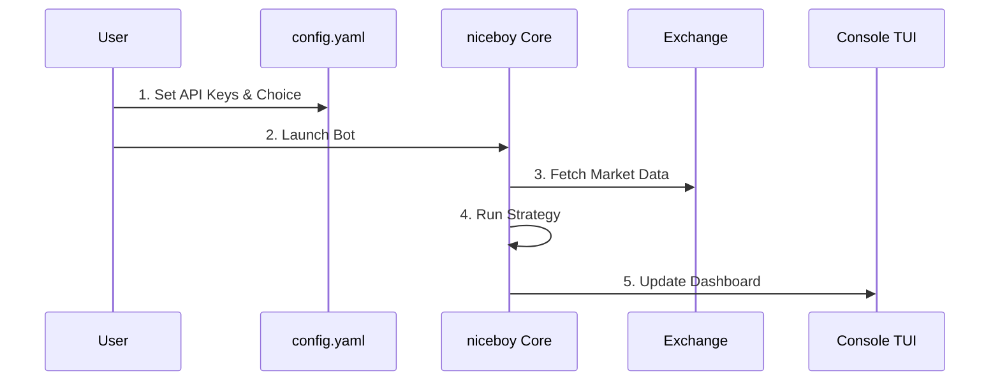

# ⚡ niceboy

> A low-footprint, high-efficiency console trading bot designed for performance and simplicity.

`niceboy` is built for traders who value speed, reliability, and minimal resource usage. It provides a robust foundation for executing automated trading strategies directly from your terminal.

## 🔄 How it Works



## ✨ Features

- **🚀 Low Footprint**: Optimized Go core with sub-10MB memory usage.
- **🖥️ Console-First TUI**: Interactive terminal interface powered by Bubble Tea.
- **🔌 Modular Architecture**: Plug-and-play strategies and unified exchange adapters.
- **🛡️ Secure & Resilient**: Local-first security with recovery-guarded trading loops.
- **📊 Structured Auditing**: Dual-output logging (Console + JSON) for full traceability.

## 🛠️ Technology Stack

- **Language**: [Go 1.24+](https://go.dev/) (Chosen for its official SDK support and efficient concurrency).
- **Logging**: [zerolog](https://github.com/rs/zerolog) (High-performance, structured JSON, persistent audit trail).
- **Exchange Integration**: Official SDKs for Binance and Bitkub via a unified runtime adapter.
- **UI Framework**: [Bubble Tea](https://github.com/charmbracelet/bubbletea) (Terminal User Interface).

## 🚀 Quick Start

Get your bot running in 3 simple steps:

1. **Clone and Setup**:
   ```bash
   git clone https://github.com/netfirms/niceboy.git
   cd niceboy
   go mod download
   ```

2. **Configure**:
   ```bash
   touch config.yaml # Add your exchange and keys
   ```

3. **Run**:
   ```bash
   go run cmd/niceboy/main.go
   ```

## 👯 Running Multiple Instances

`niceboy` supports running multiple independent instances on the same machine. Use CLI flags to specify unique configurations and log files:

```bash
# Instance 1: Binance
go run cmd/niceboy/main.go -config binance_config.yaml -log binance.log

# Instance 2: Bitkub
go run cmd/niceboy/main.go -config bitkub_config.yaml -log bitkub.log
```

For detailed setup, configuration, and production build instructions, see the [**Run Guide (docs/RUN.md)**](docs/RUN.md).

## 📜 Documentation

- [Architecture Overview](ARCHITECTURE.md)
- [Design Goals](GOALS.md)
- [Research: Go vs Rust](RESEARCH_RESULTS.md)
- [Configuration Guide](CONFIG.md)

## ⚖️ License

`niceboy` is released under the **MIT License**. See [LICENSE](LICENSE) for more details.

## 🤝 Contributing

Contributions are what make the open-source community such an amazing place to learn, inspire, and create. Any contributions you make are **greatly appreciated**. Please see our [Contributing Guide](CONTRIBUTING.md) for more details.

---

*Built with ❤️ for the trading community.*
