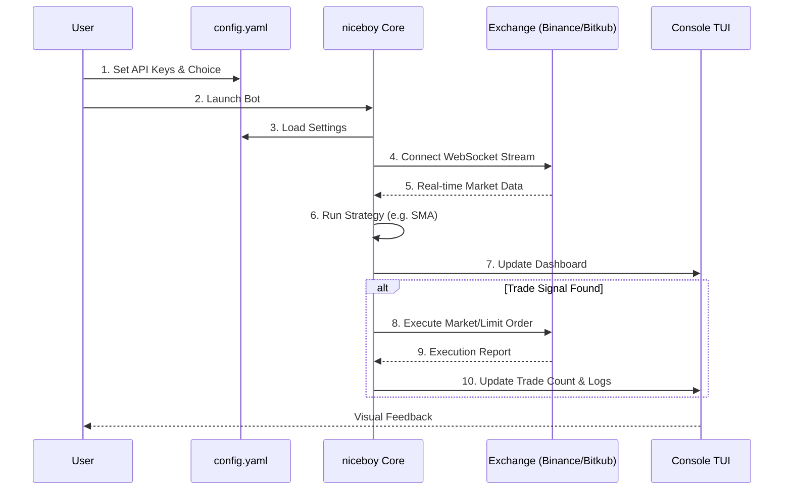

# 🔄 How niceboy Works

This diagram illustrates the typical lifecycle of a `niceboy` session from a user's perspective.

## 🛠️ Step-by-Step Breakdown

1.  **Configuration**: User provides API credentials and selects the active exchange and strategy in `config.yaml`.
2.  **Lifecycle Start**: The bot initializes the selected exchange adapter and strategy.
3.  **Real-time Loop**: Market data is streamed instantly via WebSocket connections (e.g., Binance `WsBookTickerServe`).
4.  **Intelligence**: The strategy engine processes the data and generates signals (BUY/SELL).
5.  **Execution**: The execution engine handles exact order payload structure and fires trades based on strategy cues.
6.  **Visualization**: Everything is presented in a clean, interactive TUI.
